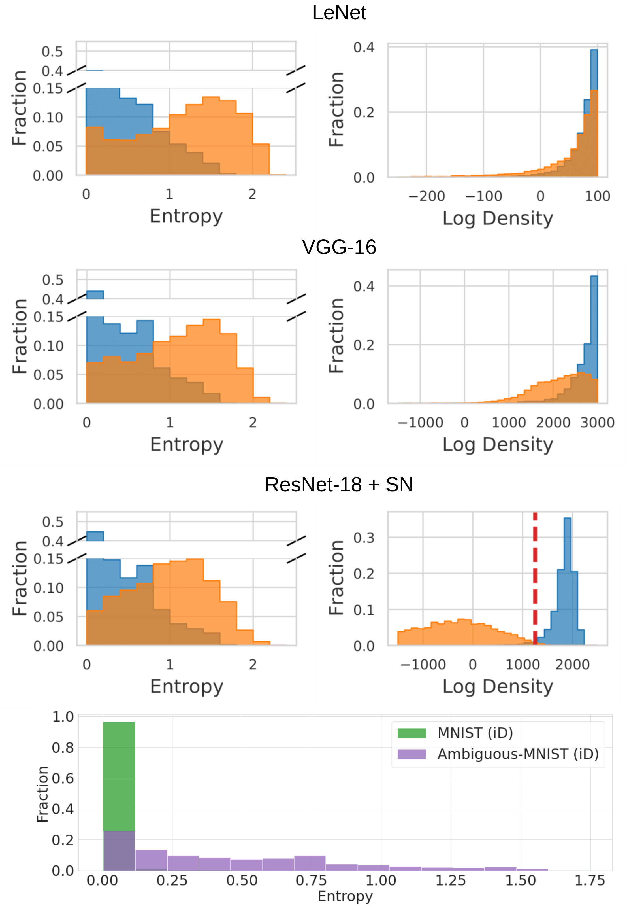
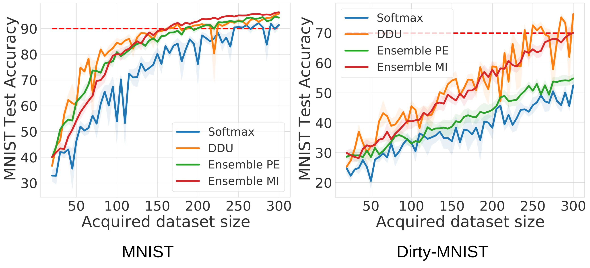

# Deep Deterministic Uncertainty

[](https://arxiv.org/abs/2102.11582)
[](https://pytorch.org/)
[](https://github.com/omegafragger/DDU/blob/main/LICENSE)

This repository contains the code for [*Deterministic Neural Networks with Appropriate Inductive Biases Capture Epistemic and Aleatoric Uncertainty*](https://arxiv.org/abs/2102.11582).

If the code or the paper has been useful in your research, please add a citation to our work:

```
@article{mukhoti2021deterministic,
  title={Deterministic Neural Networks with Appropriate Inductive Biases Capture Epistemic and Aleatoric Uncertainty},
  author={Mukhoti, Jishnu and Kirsch, Andreas and van Amersfoort, Joost and Torr, Philip HS and Gal, Yarin},
  journal={arXiv preprint arXiv:2102.11582},
  year={2021}
}
```

## Dependencies

The code is based on PyTorch and requires a few further dependencies, listed in [environment.yml](environment.yml). It should work with newer versions as well.


## OoD Detection

### Datasets

For OoD detection, you can train on [*CIFAR-10/100*](https://www.cs.toronto.edu/~kriz/cifar.html). You can also train on [*Dirty-MNIST*](https://blackhc.github.io/ddu_dirty_mnist/) by downloading *Ambiguous-MNIST* (```amnist_labels.pt``` and ```amnist_samples.pt```) from [here](https://github.com/BlackHC/ddu_dirty_mnist/releases/tag/data-v0.6.0) and using the following training instructions.

### Training

In order to train a model for the OoD detection task, use the [train.py](train.py) script. Following are the main parameters for training:
```
--seed: seed for initialization
--dataset: dataset used for training (cifar10/cifar100/dirty_mnist)
--dataset-root: /path/to/amnist_labels.pt and amnist_samples.pt/ (if training on dirty-mnist)
--model: model to train (wide_resnet/vgg16/resnet18/resnet50/lenet)
-sn: whether to use spectral normalization (available for wide_resnet, vgg16 and resnets)
--coeff: Coefficient for spectral normalization
-mod: whether to use architectural modifications (leaky ReLU + average pooling in skip connections)
--save-path: path/for/saving/model/
```

As an example, in order to train a Wide-ResNet-28-10 with spectral normalization and architectural modifications on CIFAR-10, use the following:
```
python train.py \
       --seed 1 \
       --dataset cifar10 \
       --model wide_resnet \
       -sn -mod \
       --coeff 3.0 
```
Similarly, to train a ResNet-18 with spectral normalization on Dirty-MNIST, use:
```
python train.py \
       --seed 1 \
       --dataset dirty-mnist \
       --dataset-root /home/user/amnist/ \
       --model resnet18 \
       -sn \
       --coeff 3.0
```

### Evaluation

To evaluate trained models, use [evaluate.py](evaluate.py). This script can evaluate and aggregate results over multiple experimental runs. For example, if the pretrained models are stored in a directory path ```/home/user/models```, store them using the following directory structure:
```
models
├── Run1
│   └── wide_resnet_1_350.model
├── Run2
│   └── wide_resnet_2_350.model
├── Run3
│   └── wide_resnet_3_350.model
├── Run4
│   └── wide_resnet_4_350.model
└── Run5
    └── wide_resnet_5_350.model
```
For an ensemble of models, store the models using the following directory structure:
```
model_ensemble
├── Run1
│   ├── wide_resnet_1_350.model
│   ├── wide_resnet_2_350.model
│   ├── wide_resnet_3_350.model
│   ├── wide_resnet_4_350.model
│   └── wide_resnet_5_350.model
├── Run2
│   ├── wide_resnet_10_350.model
│   ├── wide_resnet_6_350.model
│   ├── wide_resnet_7_350.model
│   ├── wide_resnet_8_350.model
│   └── wide_resnet_9_350.model
├── Run3
│   ├── wide_resnet_11_350.model
│   ├── wide_resnet_12_350.model
│   ├── wide_resnet_13_350.model
│   ├── wide_resnet_14_350.model
│   └── wide_resnet_15_350.model
├── Run4
│   ├── wide_resnet_16_350.model
│   ├── wide_resnet_17_350.model
│   ├── wide_resnet_18_350.model
│   ├── wide_resnet_19_350.model
│   └── wide_resnet_20_350.model
└── Run5
    ├── wide_resnet_21_350.model
    ├── wide_resnet_22_350.model
    ├── wide_resnet_23_350.model
    ├── wide_resnet_24_350.model
    └── wide_resnet_25_350.model
```
Following are the main parameters for evaluation:
```
--seed: seed used for initializing the first trained model
--dataset: dataset used for training (cifar10/cifar100)
--ood_dataset: OoD dataset to compute AUROC
--load-path: /path/to/pretrained/models/
--model: model architecture to load (wide_resnet/vgg16)
--runs: number of experimental runs
-sn: whether the model was trained using spectral normalization
--coeff: Coefficient for spectral normalization
-mod: whether the model was trained using architectural modifications
--ensemble: number of models in the ensemble
--model-type: type of model to load for evaluation (softmax/ensemble/gmm)
```
As an example, in order to evaluate a Wide-ResNet-28-10 with spectral normalization and architectural modifications on CIFAR-10 with OoD dataset as SVHN, use the following:
```
python evaluate.py \
       --seed 1 \
       --dataset cifar10 \
       --ood_dataset svhn \
       --load-path /path/to/pretrained/models/ \
       --model wide_resnet \
       --runs 5 \
       -sn -mod \
       --coeff 3.0 \
       --model-type softmax
```
Similarly, to evaluate the above model using feature density, set ```--model-type gmm```. The evaluation script assumes that the seeds of models trained in consecutive runs differ by 1. The script stores the results in a json file with the following structure: 
```
{
    "mean": {
        "accuracy": mean accuracy,
        "ece": mean ECE,
        "m1_auroc": mean AUROC using log density / MI for ensembles,
        "m1_auprc": mean AUPRC using log density / MI for ensembles,
        "m2_auroc": mean AUROC using entropy / PE for ensembles,
        "m2_auprc": mean AUPRC using entropy / PE for ensembles,
        "t_ece": mean ECE (post temp scaling)
        "t_m1_auroc": mean AUROC using log density / MI for ensembles (post temp scaling),
        "t_m1_auprc": mean AUPRC using log density / MI for ensembles (post temp scaling),
        "t_m2_auroc": mean AUROC using entropy / PE for ensembles (post temp scaling),
        "t_m2_auprc": mean AUPRC using entropy / PE for ensembles (post temp scaling)
    },
    "std": {
        "accuracy": std error accuracy,
        "ece": std error ECE,
        "m1_auroc": std error AUROC using log density / MI for ensembles,
        "m1_auprc": std error AUPRC using log density / MI for ensembles,
        "m2_auroc": std error AUROC using entropy / PE for ensembles,
        "m2_auprc": std error AUPRC using entropy / PE for ensembles,
        "t_ece": std error ECE (post temp scaling),
        "t_m1_auroc": std error AUROC using log density / MI for ensembles (post temp scaling),
        "t_m1_auprc": std error AUPRC using log density / MI for ensembles (post temp scaling),
        "t_m2_auroc": std error AUROC using entropy / PE for ensembles (post temp scaling),
        "t_m2_auprc": std error AUPRC using entropy / PE for ensembles (post temp scaling)
    },
    "values": {
        "accuracy": accuracy list,
        "ece": ece list,
        "m1_auroc": AUROC list using log density / MI for ensembles,
        "m2_auroc": AUROC list using entropy / PE for ensembles,
        "t_ece": ece list (post temp scaling),
        "t_m1_auroc": AUROC list using log density / MI for ensembles (post temp scaling),
        "t_m1_auprc": AUPRC list using log density / MI for ensembles (post temp scaling),
        "t_m2_auroc": AUROC list using entropy / PE for ensembles (post temp scaling),
        "t_m2_auprc": AUPRC list using entropy / PE for ensembles (post temp scaling)
    },
    "info": {dictionary of args}
}
```

### Results

#### Dirty-MNIST

To visualise DDU's performance on Dirty-MNIST (i.e., Fig. 1 of the paper), use [fig_1_plot.ipynb](notebooks/fig_1_plot.ipynb). The notebook requires a pretrained LeNet, VGG-16 and ResNet-18 with spectral normalization trained on Dirty-MNIST and visualises the softmax entropy and feature density for Dirty-MNIST (iD) samples vs Fashion-MNIST (OoD) samples. The notebook also visualises the softmax entropies of MNIST vs Ambiguous-MNIST samples for the ResNet-18+SN model (Fig. 2 of the paper). The following figure shows the output of the notebook for the LeNet, VGG-16 and ResNet18+SN model we trained on Dirty-MNIST.

<p align="center">
  
</p>

#### CIFAR-10 vs SVHN

The following table presents results for a Wide-ResNet-28-10 architecture trained on CIFAR-10 with SVHN as the OoD dataset. For the full set of results, refer to the [paper](https://arxiv.org/abs/2102.11582).

| Method  | Aleatoric Uncertainty | Epistemic Uncertainty | Test Accuracy | Test ECE | AUROC |
| ---  | --- | --- | --- | --- | --- |
| Softmax  | Softmax Entropy | Softmax Entropy | 95.98+-0.02 | 0.85+-0.02 | 94.44+-0.43 |
| [Energy-based](https://arxiv.org/abs/2010.03759) | Softmax Entropy | Softmax Density | 95.98+-0.02 | 0.85+-0.02 | 94.56+-0.51 |
| [5-Ensemble](https://arxiv.org/abs/1612.01474)  | Predictive Entropy | Predictive Entropy | 96.59+-0.02 | 0.76+-0.03 | 97.73+-0.31 |
| DDU (ours)  | Softmax Entropy | GMM Density | 95.97+-0.03 | 0.85+-0.04 | 98.09+-0.10 |


## Active Learning

To run active learning experiments, use ```active_learning_script.py```. You can run active learning experiments on both [MNIST](http://yann.lecun.com/exdb/mnist/) as well as [Dirty-MNIST](https://blackhc.github.io/ddu_dirty_mnist/). When running with Dirty-MNIST, you will need to provide a pretrained model on Dirty-MNIST to distinguish between clean MNIST and Ambiguous-MNIST samples. The following are the main command line arguments for ```active_learning_script.py```.
```
--seed: seed used for initializing the first model (later experimental runs will have seeds incremented by 1)
--model: model architecture to train (resnet18)
-ambiguous: whether to use ambiguous MNIST during training. If this is set to True, the models will be trained on Dirty-MNIST, otherwise they will train on MNIST.
--dataset-root: /path/to/amnist_labels.pt and amnist_samples.pt/
--trained-model: model architecture of pretrained model to distinguish clean and ambiguous MNIST samples
-tsn: if pretrained model has been trained using spectral normalization
--tcoeff: coefficient of spectral normalization used on pretrained model
-tmod: if pretrained model has been trained using architectural modifications (leaky ReLU and average pooling on skip connections)
--saved-model-path: /path/to/saved/pretrained/model/
--saved-model-name: name of the saved pretrained model file
--threshold: Threshold of softmax entropy to decide if a sample is ambiguous (samples having higher softmax entropy than threshold will be considered ambiguous)
--subsample: number of clean MNIST samples to use to subsample clean MNIST
-sn: whether to use spectral normalization during training
--coeff: coefficient of spectral normalization during training
-mod: whether to use architectural modifications (leaky ReLU and average pooling on skip connections) during training
--al-type: type of active learning acquisition model (softmax/ensemble/gmm)
-mi: whether to use mutual information for ensemble al-type
--num-initial-samples: number of initial samples in the training set
--max-training-samples: maximum number of training samples
--acquisition-batch-size: batch size for each acquisition step
```

As an example, to run the active learning experiment on MNIST using the DDU method, use:
```
python active_learning_script.py \
       --seed 1 \
       --model resnet18 \
       -sn -mod \
       --al-type gmm
```
Similarly, to run the active learning experiment on Dirty-MNIST using the DDU baseline, with a pretrained ResNet-18 with SN to distinguish clean and ambiguous MNIST samples, use the following:
```
python active_learning_script.py \
       --seed 1 \
       --model resnet18 \
       -sn -mod \
       -ambiguous \
       --dataset-root /home/user/amnist/ \
       --trained-model resnet18 \
       -tsn \
       --saved-model-path /path/to/pretrained/model \
       --saved-model-name resnet18_sn_3.0_1_350.model \
       --threshold 1.0 \
       --subsample 1000 \
       --al-type gmm
```

### Results

The active learning script stores all results in json files. The MNIST test set accuracy is stored in a json file with the following structure:
```
{
    "experiment run": list of MNIST test set accuracies one per acquisition step
}
```
When using ambiguous samples in the pool set, the script also stores the fraction of ambiguous samples acquired in each step in the following json:
```
{
    "experiment run": list of fractions of ambiguous samples in the acquired training set
}
```

### Visualisation

To visualise results from the above json files, use the [al_plot.ipynb](notebooks/al_plot.ipynb) notebook. The following diagram shows the performance of different baselines (softmax, ensemble PE, ensemble MI and DDU) on MNIST and Dirty-MNIST.

<p align="center">
  
</p>


## Questions

For any questions, please feel free to raise an issue or email us directly. Our emails can be found on the [paper](https://arxiv.org/abs/2102.11582).
