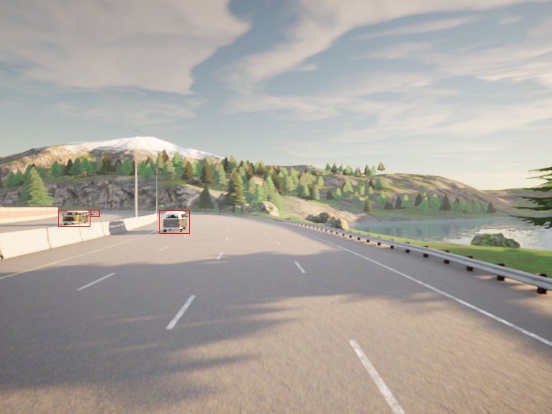

# Deep Deterministic Uncertainty

This repository contains code for computing the uncertainty of object detection bounding boxes using Gaussian Mixture Model. {{WORK-IN-PROGRESS}}

As a result, the trained Gaussian Mixture Model (GMM) will compute the uncertainty (or certainty) corresponding to each bounding box detected.

## Commands:

```
For Training:

python train.py --seed 1 --dataset carla --dataset-root carla_root --model resnet18 -sn --coeff 3.0


For Evaluation:

python evaluate.py --seed 1 --dataset carla --ood_dataset svhn --load-path carla_train_models/ --model resnet18 --runs 1 -sn --coeff 3.0 --model-type gmm
```

## Sample Test Image:


This image contains 3 class labels, namely, 0(car), 0(car), 0(car)


Gaussian Probabilities Computed For Test Image:

```
{
   "106495_0": {
        "0": {
            "raw_gaussian_mixture_probs": "[1468.643, -53119774000000.0, -294402300000000.0, -42392472000000.0]",
            "refined_probs": "[1.0, 0.0, 0.0, 0.0]"
        }
    },
    "106495_1": {
        "0": {
            "raw_gaussian_mixture_probs": "[1449.6852, -120552635000000.0, -682718300000000.0, -188379900000000.0]",
            "refined_probs": "[1.0, 0.0, 0.0, 0.0]"
        }
    },
    "106495_2": {
        "0": {
            "raw_gaussian_mixture_probs": "[1654.3842, -51243730000000.0, -388324800000000.0, -32194863000000.0]",
            "refined_probs": "[1.0, 0.0, 0.0, 0.0]"
        }
    }
}
```

It can be clearly seen that Gaussian Probability of class 0 (which is the original class of the object detected is computed to be the highest)

## Gaussian probabilies computed for a series of test images can be found in the file - image_prob_mappings.json

## Next Steps - To extend the uncertainty computation capabilities to bounding box vectors.


### Citation:
```
@article{mukhoti2021deterministic,
  title={Deterministic Neural Networks with Appropriate Inductive Biases Capture Epistemic and Aleatoric Uncertainty},
  author={Mukhoti, Jishnu and Kirsch, Andreas and van Amersfoort, Joost and Torr, Philip HS and Gal, Yarin},
  journal={arXiv preprint arXiv:2102.11582},
  year={2021}
}
```

